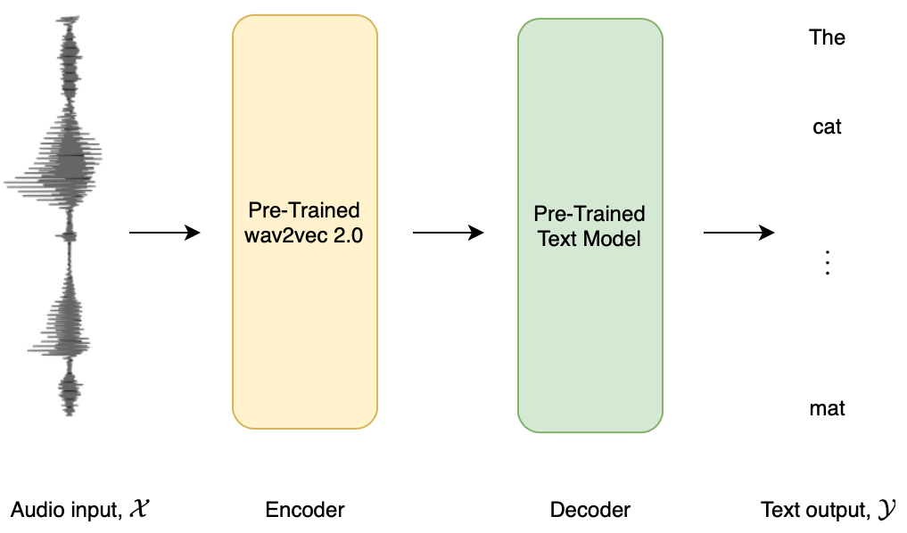

# Seq2Seq Speech in JAX
A [JAX](https://jax.readthedocs.io/en/latest/)/[Flax](https://flax.readthedocs.io/en/latest/) repository for combining a pre-trained speech encoder model (e.g. Wav2Vec2, HuBERT, WavLM) with a pre-trained text decoder model (e.g. GPT2, Bart) to yield a Speech Sequence-to-Sequence (Seq2Seq) model for automatic speech recognition. 

The script `run_flax_speech_recognition_seq2seq.py` can be used to fine-tune a Speech Seq2Seq model on one of the official speech recognition datasets or a custom dataset. It makes use of the `pmap` JAX operator to provide data parallelism accross GPU/TPU devices.

The modelling files are based very heavily on those from Hugging Face [Transformers 🤗](https://github.com/huggingface/transformers). This is a standalone repository to enable rapid prototyping and involvement with the community. The final modelling files and training script will be merged into Transformers 🤗 to be used with the rest of the open-source library. The final system weights will be made publicly available at [huggingface.co](huggingface.co) 🚀


**Figure 1:** Speech-encoder text-decoder style Seq2Seq model.

## Example Usage
To instantiate a _Wav2Vec2-2-Bart_ model with the `FlaxSpeechEncoderDecoderModel` framework, run the following Python script inside the cloned repo:
```python
from transformers import AutoFeatureExtractor, AutoTokenizer
from models.modeling_flax_speech_encoder_decoder import FlaxSpeechEncoderDecoderModel
import numpy as np

# checkpoints to leverage
encoder_id = "facebook/wav2vec2-large-lv60"
decoder_id = "facebook/bart-large"

model = FlaxSpeechEncoderDecoderModel.from_encoder_decoder_pretrained(
    encoder_id, decoder_id, encoder_add_adapter=True, decoder_from_pt=True)

model.config.decoder_start_token_id = model.config.decoder.bos_token_id
model.config.pad_token_id = model.config.decoder.pad_token_id
model.config.eos_token_id = model.config.decoder.eos_token_id
model.config.use_cache = False
model.config.processor_class = "Wav2Vec2Processor"

# check if generation works
out = model.generate(np.ones((1, 2000)))

model.save_pretrained("./")

feature_extractor = AutoFeatureExtractor.from_pretrained(encoder_id)
feature_extractor.save_pretrained("./")
tokenizer = AutoTokenizer.from_pretrained(decoder_id)
tokenizer.save_pretrained("./")
```

To train the model on [Librispeech ASR](https://huggingface.co/datasets/librispeech_asr), run the template bash script [`run_seq2seq_dummy.sh`](https://github.com/sanchit-gandhi/seq2seq-speech/blob/main/run_seq2seq_dummy.sh).
